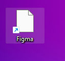
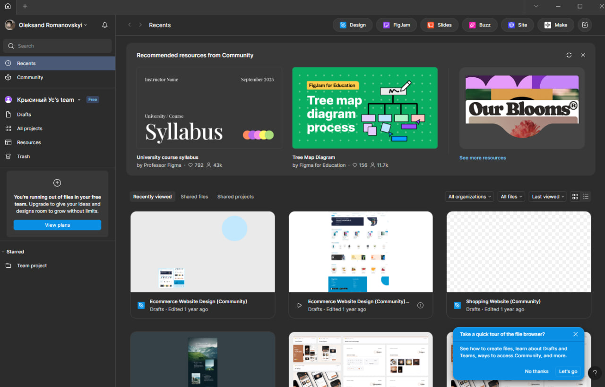

# Тема заняття:ОГЛЯД І ПОРІВНЯЛЬНА ХАРАКТЕРИСТИКА СЕРВІСІВ ДЛЯ ПРОЕКТУВАННЯ КОРИСТУВАЛЬНИЦЬКИХ ІНТЕРФЕЙСІВ

# Хід роботи
Встановлення Figma Desktop.
## Завантажив та встановив десктопну версію Figma.

# Залогінений обліковий запис у Figma
## Після запуску Figma увійшов у створений акаунт. 

Висновки
На практиці я:

- зареєструвала обліковий запис у Figma;
* завантажила та встановила десктопну версію програми;
+ виконала перший вхід у систему.

Ця робота навчила мене:
1. створювати акаунт у Figma;
2. працювати з інтерфейсом Figma та підготувати середовище для подальшої роботи.

