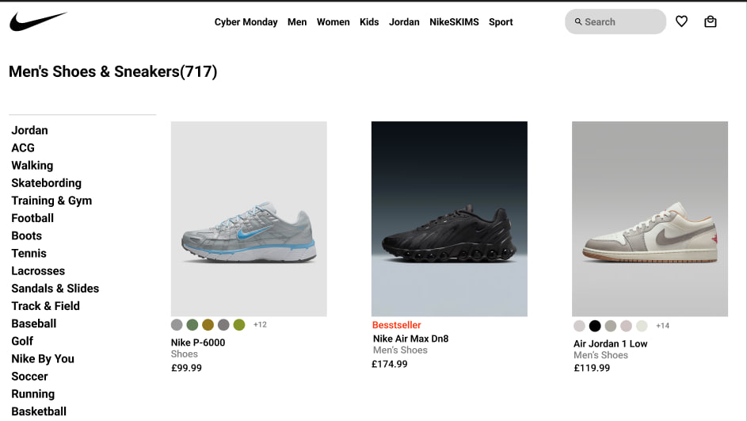
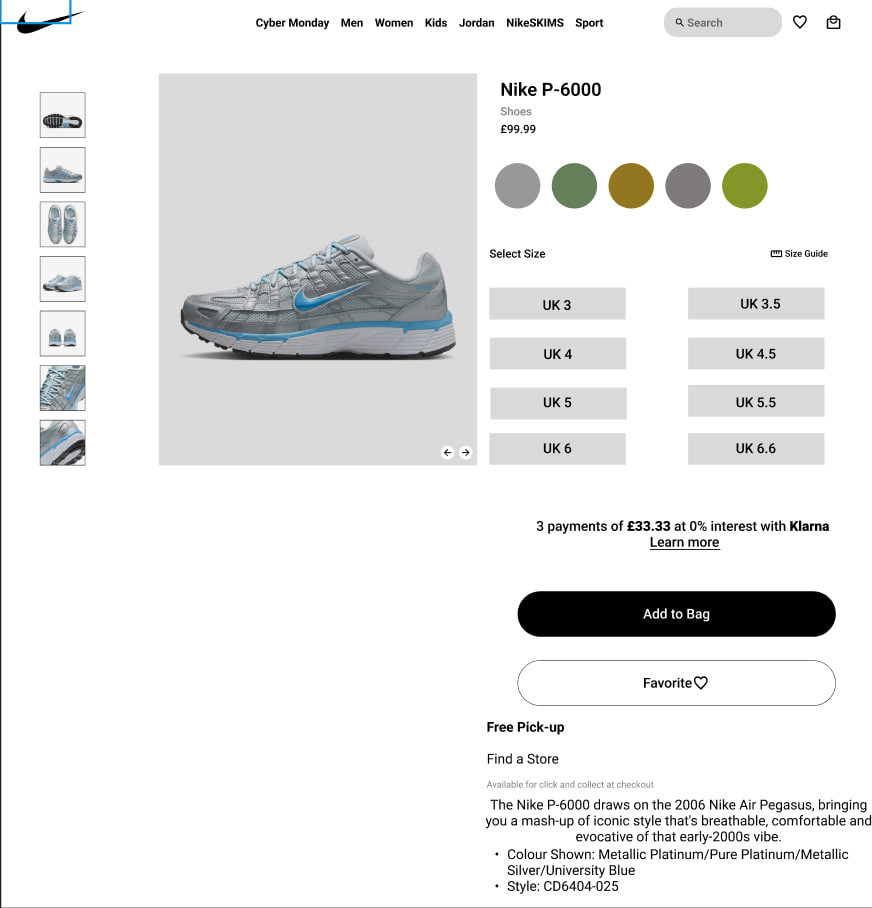
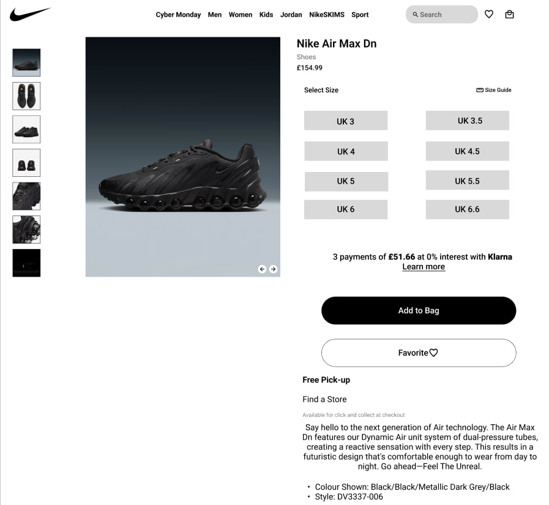
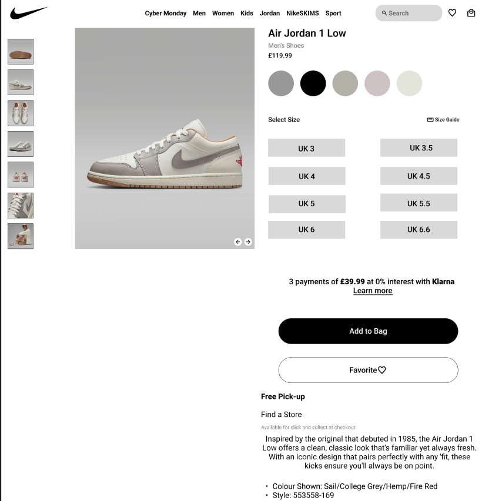
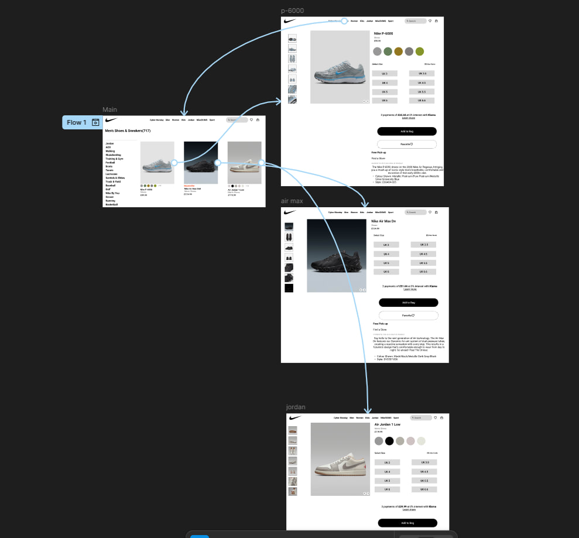

# Тема заняття:Розробка Wireframe

# Мета роботи
Створити у Figma деталізований вайрфрейм інтернет-магазину (головна сторінка та 2–3 сторінки товару) з адаптацією під розмір екранів desktop.

Використати інструменти прототипування (Interactions) для побудови клікабельного прототипу на основі розробленого вайрфрейму.

#Хід роботи
Підготовка робочого середовища  
У Figma я створив головний фрейм для wireframe головної сторінки сайту nike, а також два додаткові фрейми для сторінок товарів.

# Створення структури головної сторінки
Побудував загальну структуру сайту:

-хедер з логотипом та навігаційним меню;

-блок з категоріями;

-блок з розмірами;

-блок з описом кроссівок;

# Прототипування переходів між сторінками
У режимі Prototype я:

-створив перехід з головної сторінки на сторінку з кроссівками;

-створив перехід з сторінки з кроссівками до головной ;

-створив скрол на сторінці з кросовками.

# Скріншоти виконання роботи

## Головна сторінка

## Сторінка кроссівок

## Prototype

# Висновки:
Що ви зробили на практиці?
- Я зробив wireframe та prototype.
- Використала навчики протипування.
Що з цього випливає, чому вас це навчило?
- Постановці та гармонійності об'єктів.
- Розумінню як розроблювати шаблон та із нього створювати прототип.

