# Тема:Дослідження кольорових гармоній та інструментів аналізу кольору в Adobe Color

# Теоретична частина:
Кольорова гармонія — це поєднання кольорів, які виглядають узгоджено, приємно для ока та створюють відчуття порядку й рівноваги. У дизайні вона відіграє важливу роль, адже дозволяє формувати естетичні та дієві композиції, що викликають потрібні емоції та не створюють відчуття випадковості чи перевантаження. Завдяки гармонії кольорів дизайн сприймається цілісно — у брендингу, інтер’єрах або веб-інтерфейсах.

Основні типи кольорової гармонії:

- Analogous (аналогічна)

- Monochromatic (монохроматична)
 
- Triad (тріада)

- Complementary (комплементарна)

- Split Complementary (розділена комплементарна)

- Square (квадратна)

- Custom (власна схема)

## Колірні моделі RGB, HSB, LAB:

- RGB (Red, Green, Blue) — адитивна модель, у якій кольори створюються змішуванням світла червоного, зеленого та синього відтінків. Значення кожного компонента — від 0 до 255.

- HSB (Hue, Saturation, Brightness) — модель, зручна для сприйняття людиною.

- Hue (Відтінок) — тип кольору (0–360°).

- Saturation (Насиченість) — сила кольору (0% — сірий, 100% — максимально яскравий).

- Brightness (Яскравість) — рівень світлоти (0% — чорний, 100% — найяскравіший).

- LAB (Lightness, A, B) — модель, побудована на особливостях сприйняття кольорів людиною.

- L — світлота;

- A — вісь «зелений — червоний»;

- B — вісь «синій — жовтий».

## Перевірка доступності за контрастністю:
Контрастне співвідношення показує різницю у яскравості між текстом і фоном. Значення змінюється від 1:1 (повна відсутність контрасту) до 21:1 (максимально можливий контраст, наприклад чорний на білому).

Згідно з Web Content Accessibility Guidelines існують рівні:

## Рівень AA (базовий стандарт):

- Звичайний текст — не менше 4.5:1

- Великий текст (Bold 18pt+ або Regular 24px+) — від 3:1

- Елементи інтерфейсу (іконки, поля вводу та ін.) — від 3:1

## Рівень AAA (підвищений стандарт):

- Звичайний текст — від 7:1

- Великий текст — від 4.5:1

# Хід роботи:
## 1. Робота з колірним колесом (Color Wheel)
### Analogous
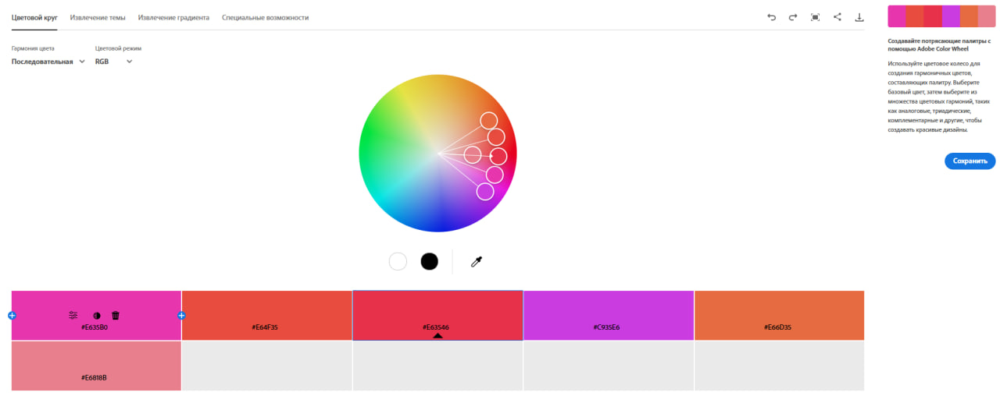
Базовий колір — #F5604B. Гармонія формується з кольорів, які знаходяться поруч один з одним на колірному колі.
Ефект: спокійність, узгодженість, м’якість для сприйняття; створює атмосферу комфорту та цілісності.

### Monochromatic
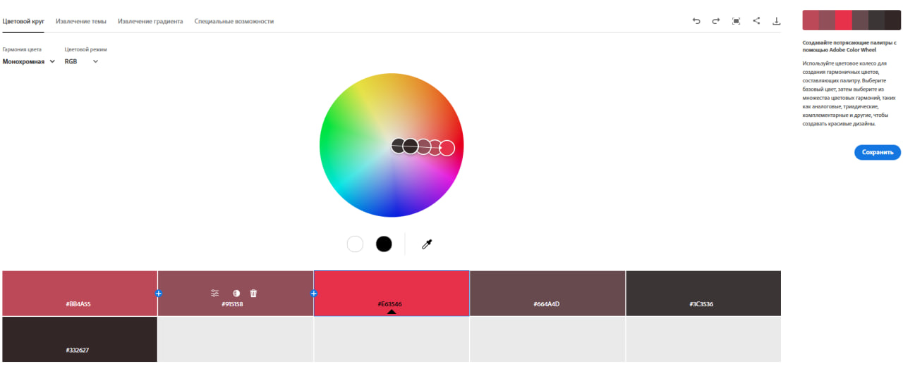
Базовий колір — #316FF5. Побудована на різних відтінках одного і того ж кольору.
Ефект: впорядкованість, стриманість, чистота й чіткість у візуальному сприйнятті.

### Triad
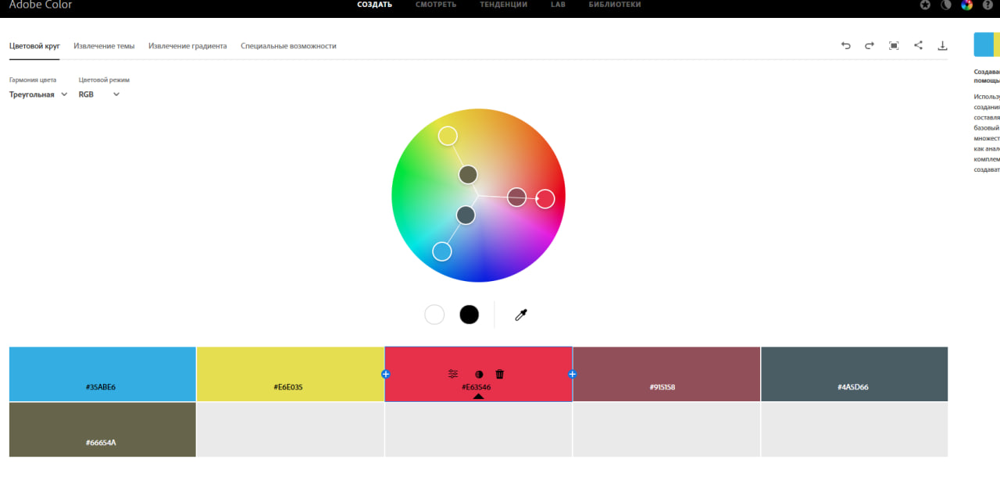
Базовий колір — #F55D55. Використовуються три кольори, що утворюють рівносторонній трикутник на колірному колі.
Ефект: динамічність, енергійність, але водночас збережений баланс.

### Complementary
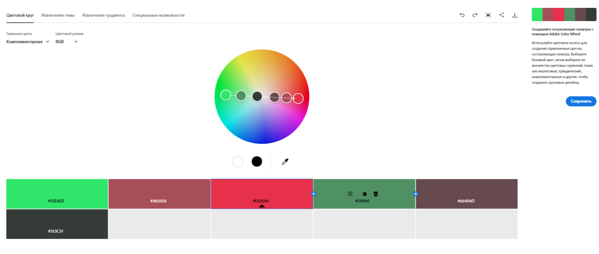
Базовий колір — #1DF507. Складається з двох кольорів, що розташовані навпроти один одного.
Ефект: сильний контраст, яскравість і помітність; привертає увагу й додає виразності.

### Split Complementary
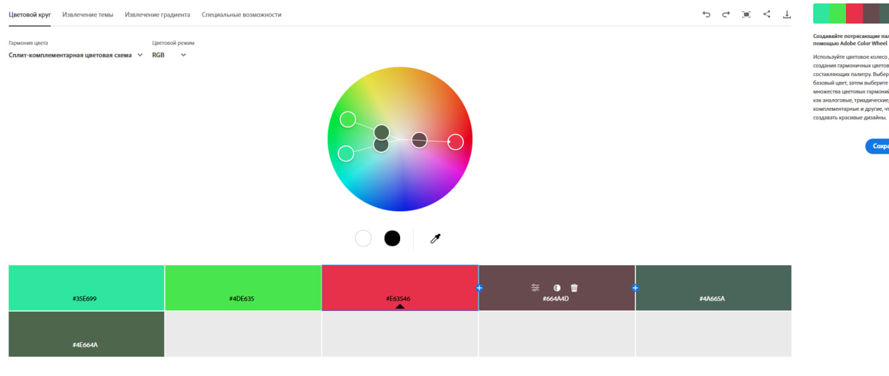
Базовий колір — #11D6F5. Містить основний колір і два відтінки, що стоять поруч із його протилежним (комплементарним).
Ефект: виразний контраст, але більш м’який і збалансований, ніж у чистій комплементарній схемі.

### Square
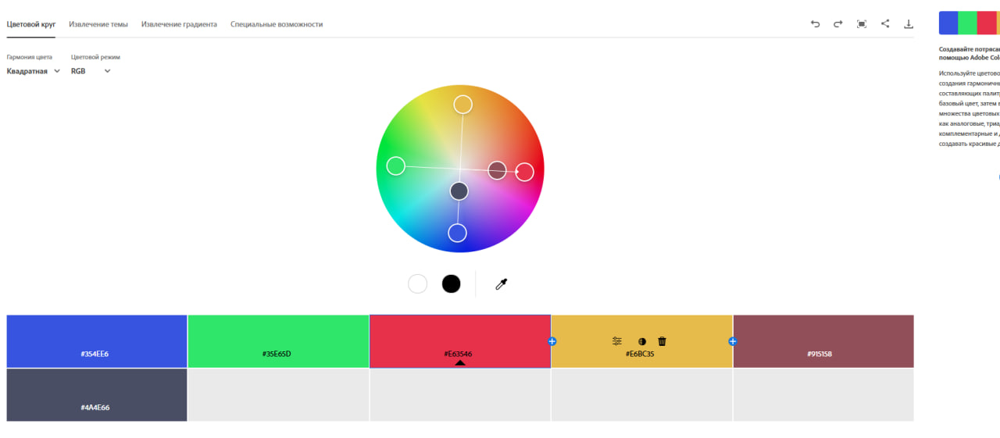
Базовий колір — #AD11F5. Створюється з чотирьох кольорів, рівномірно розміщених на колі (кожен під кутом 90° до іншого).
Ефект: насичена, яскрава та різноманітна палітра.

### Custom
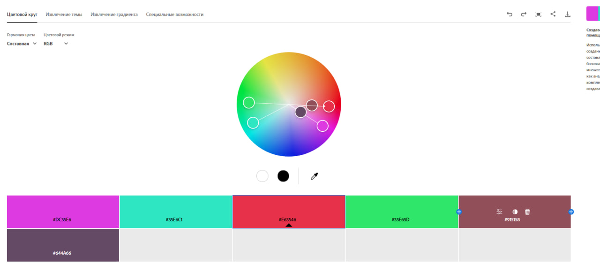
Базовий колір — #F5CA5F. Палітра формується індивідуально відповідно до бажаного розташування та взаємодії кольорів.
Ефект: ніжність, спокій та гармонія.

## 2. Створення палітри за допомогою зображення (Extract Theme)

Colorful:
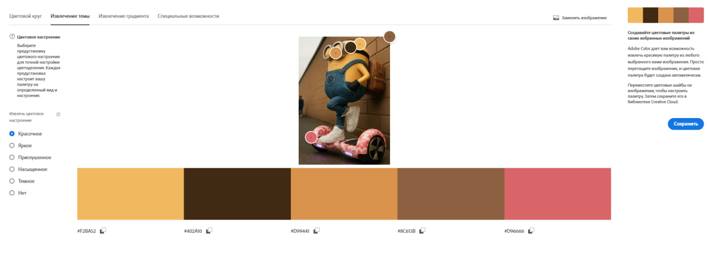
Палітра яскрава та емоційна, викликає асоціації з радістю та енергійністю.

Muted:
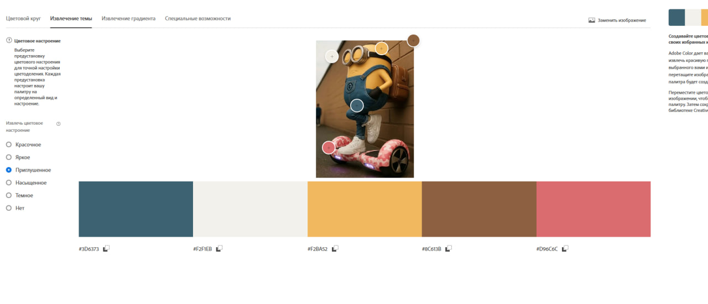
Палітра більш стримана, передає спокій і легку драматичність.

Для застосунку краще підійде друга палітра, оскільки вона виглядає врівноваженішою та пасує до спокійного стилю інтерфейсу.

## 3. Створення градієнту за зображенням (Extract Gradient)

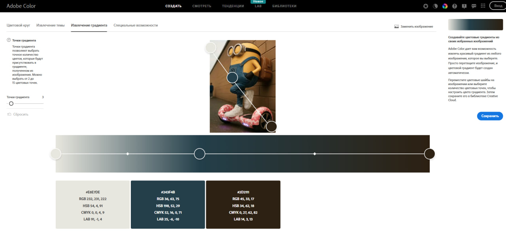
Отриманий градієнт виглядає м’яко та створює відчуття комфорту й узгодженості.

## 4. Перевірка контрасту (Accessibility Tools)

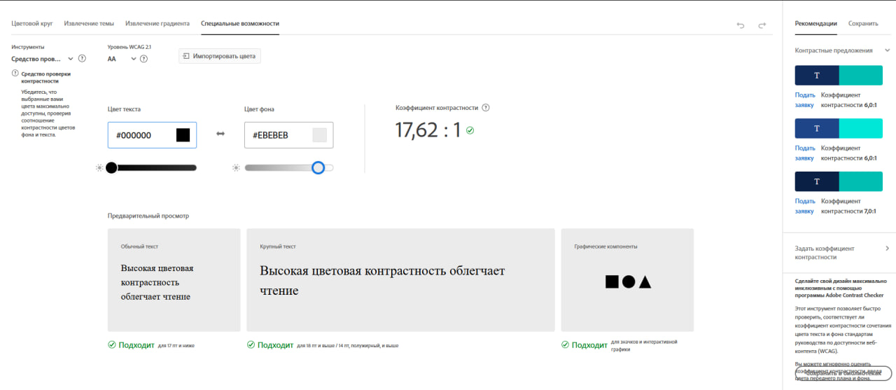
Поєднавши кольори з різних палітр, вдалося отримати читабельний приклад тексту та пройти тест на контрастність.

# Висновок:

У дизайні інтерфейсів колір виконує передусім практичну функцію, тому найбільш ефективним є комбінований підхід. Монохромна палітра забезпечує чистоту та легкість сприйняття і добре підходить для базових елементів. Аналогічні кольори створюють приємний фон і допомагають формувати атмосферу. Для кнопок та важливих акцентів найкраще використовувати контрастні поєднання, які швидко привертають увагу. Оптимальний інтерфейс тримається на поєднанні стриманої основи та чітких, помітних акцентів.

