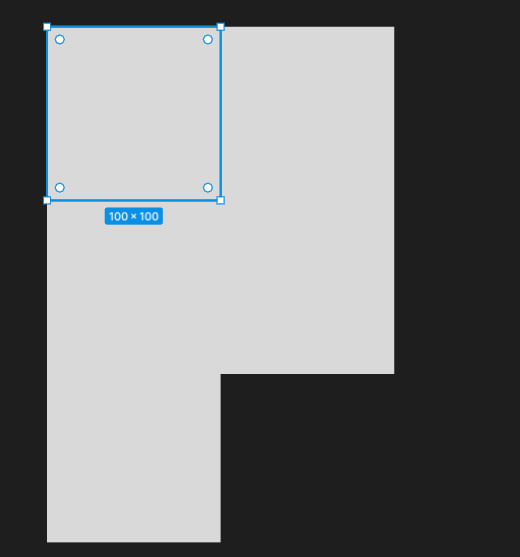
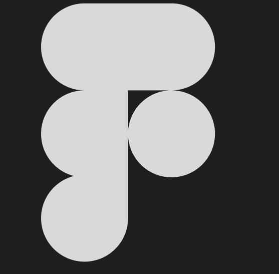
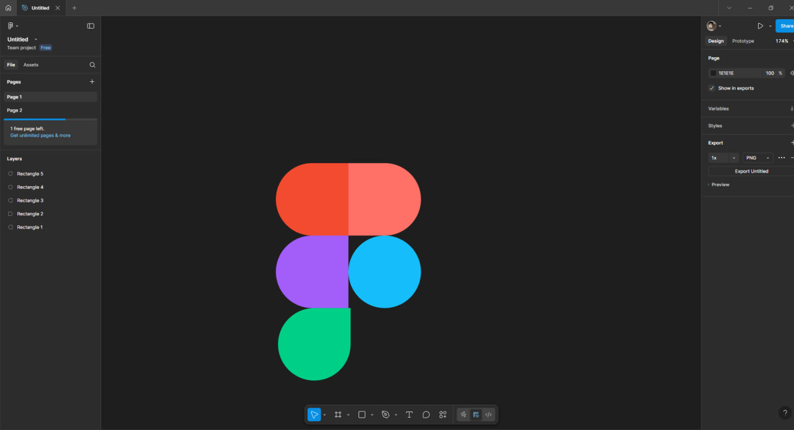

# Тема заняття: Робота з простими формами та їх властивостями у Figma. Частина 1

# Створюемо новий проект та 5 простих квадратiв довжиною 100x100

# Далі ми міняемо corner raduius завдяки Apperance або кружечкам щоб налаштувати кожен кут

# Ось таки ми зробили логотип Фігми але тепер треба його розмалювати

# Коли ми розмалювали в нас виходить справжній логотип Figma

