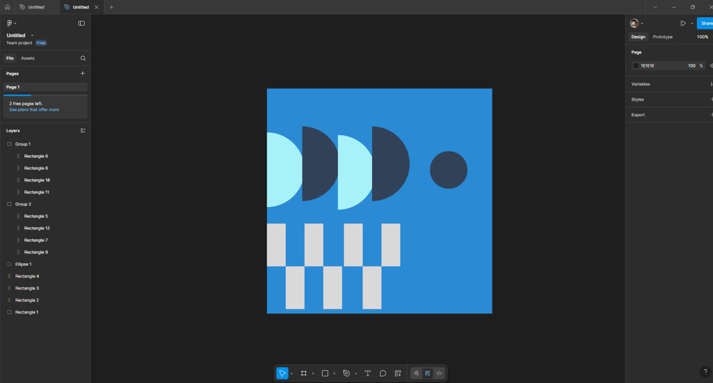

# Тема:Робота з простими формами та їх властивостями у Figma. Створення геометричного візерунку.Частина 2

## Хід роботи 
-Спочатку обираю візерунок с цього прикладу https://www.figma.com/design/3fUhVxZnRrlhGqkdTR9RT8/20-Patterns--Community-?node-id=101-60&p=f&t=bD0SLHHKgPZtY1Lf-0
-Далі робимо великий квадрат розміром 600x600 і повторюемо візерунок

### І ось що я зробив 

# Висновок 
Висновок:
Практична робота полягала у створенні оригінальних геометричних композицій з простих фігур. Цей етап став справжнім викликом, оскільки вимагав поглибленого вивчення теорії. Завдяки ретельному ознайомленню з текстовим матеріалом, я навчився успішно відтворювати фрагменти геометричних візерунків за допомогою Figma.

