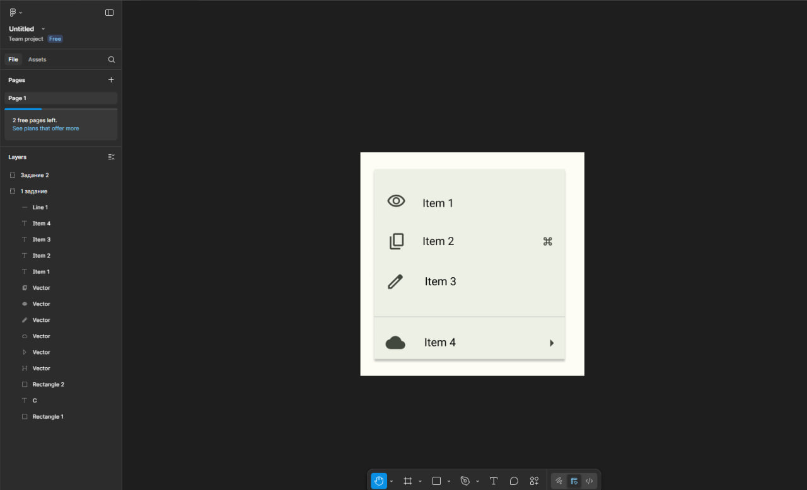
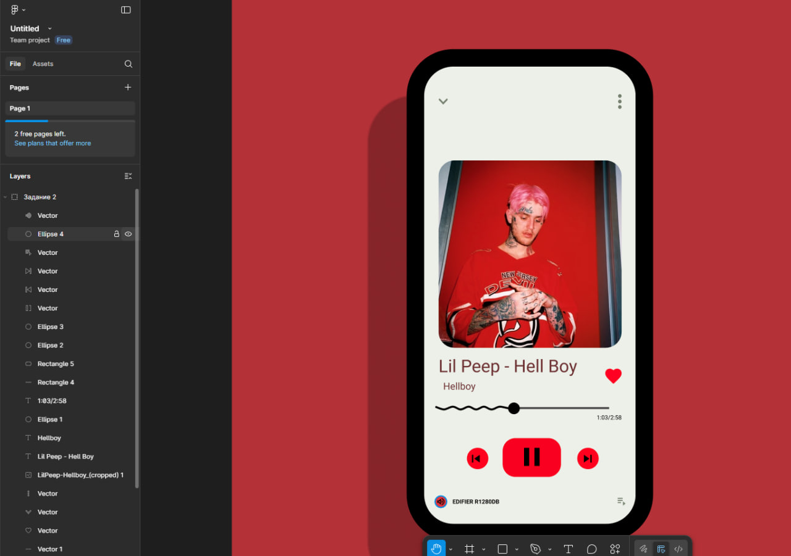

# Тема:Фрейми, групи і секції у Figma

# Хід роботи

## 1.Виконання завдання Basic
 -Для базової частини я створив композицію з іконок, використовуючи ресурс [Google Fonts Icons.](https://fonts.google.com/icons)
 -Іконки були імпортовані у svg форматі у Figma та розміщені у фреймі. Для підписів до кожної іконки використав шрифт Roboto.
 

 ## 2.Виконання завдання Medium

 -Інтерфейс аудіоплеєра скомпоновано в межах одного фрейму.
 -Він об'єднує всі елементи керування (кнопки відтворення/перемикання, прогрес-бар) та зображення альбому.
 -Текстові елементи, як-от назва треку, виконавець і час, оформлені шрифтом Roboto.
 -Усі іконки реалізовані за допомогою ресурсу [Google Fonts Icons.](https://fonts.google.com/icons)
 
 

