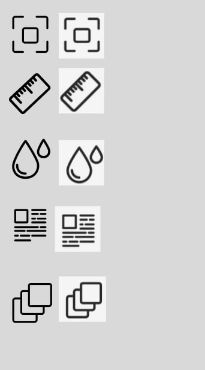

# Практична робота №5
Тема: Криві Безьє та векторні об’єкти у Figma. Створення іконок у векторному форм
## Хід роботи
- 1.Ознайомився з розділами №9 (Перо) і №10 (Векторні мережі) у Керівництві користувача Figma.
- 2.Для тренування роботи з кривими Безьє виконав вправи на сайті [The Bezier Game.](https://bezier.method.ac/?authuser=0)
- 3.За допомогою інструмента Pen Tool створив п’ять векторних іконок у обводковому стилі.
- 4.Кожна іконка виконана окремо.
# Результати роботи
 
# Посилання
[Figma](https://www.figma.com/design/84NxmwaFSGGRW46gijMhOR/Untitled?node-id=0-1&t=UhBiB0FL8Rk1wEsL-1)
# Висновок 
Під час виконання практичної роботи я опанував використання інструменту Pen Tool для побудови кривих Безьє, а також навчився створювати векторні лінії та прості іконки у Figma.
Набуті вміння сприяють глибшому розумінню принципів роботи з векторною графікою та дозволяють ефективно застосовувати їх під час проєктування інтерфейсів.
