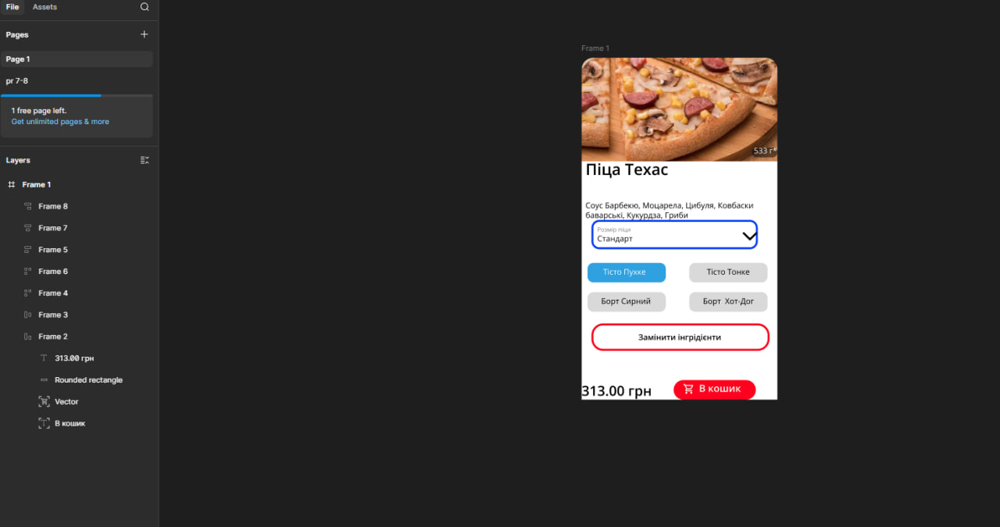

# Практична робота №9
## Тема: Функція Auto layout у Figma. Створення картки товару (послуги)

# Мета роботи
Ознайомитися з можливостями Auto layout у Figma та навчитися створювати зручні, адаптивні картки товарів або послуг із використанням цього інструмента.
Закріпити навички роботи з іконками, зображеннями, текстом та компонентами.

# Завдання
Створити малу картку товару, використовуючи функцію Auto layout у Figma.
Під час оформлення застосувати відповідне зображення, текст, іконки та елементи керування (кнопки).

# Хід роботи
Опрацював розділ із “Керівництва користувача Figma” про Auto layout.  

Створив основу картки з прямокутників і текстових блоків.

Додав Auto layout для зручного вирівнювання елементів.

Вставив іконку кошик.  

Вирівняв всі елементи для гармонійного візуального вигляду.  

## Результат роботи
Нижче наведено готову картку товару, створену мною у Figma за допомогою Auto layout:

Картка товару

[Переглянути проєкт у Figma](https://www.figma.com/design/84NxmwaFSGGRW46gijMhOR/Untitled?node-id=0-1&t=FrEPmwKjXLfvYZS3-1)

# Висновок
Під час виконання цієї практичної роботи я навчився працювати з Auto layout у Figma.  
Освоїв створення структурованих і гнучких макетів, у яких елементи автоматично вирівнюються та адаптуються при зміні розміру.  
Отримані знання допоможуть мені швидше створювати інтерфейсні компоненти, які зручно редагувати та масштабувати.  

