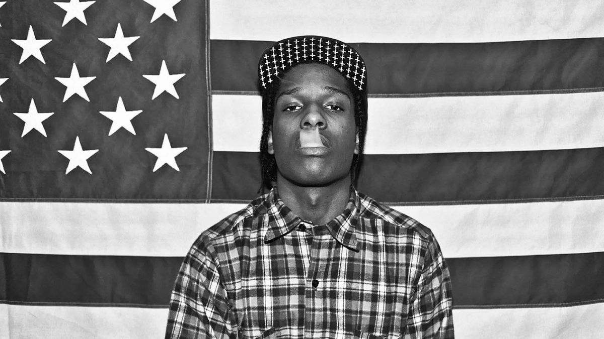
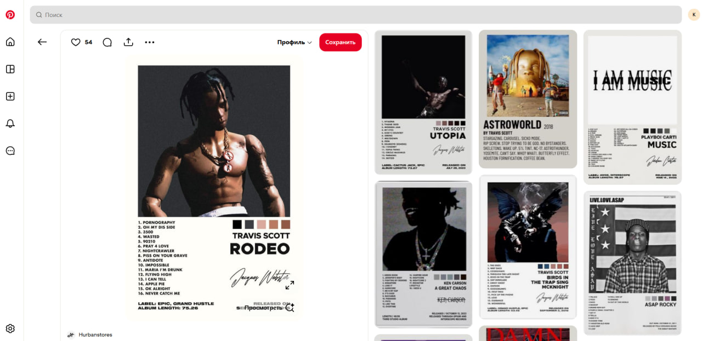
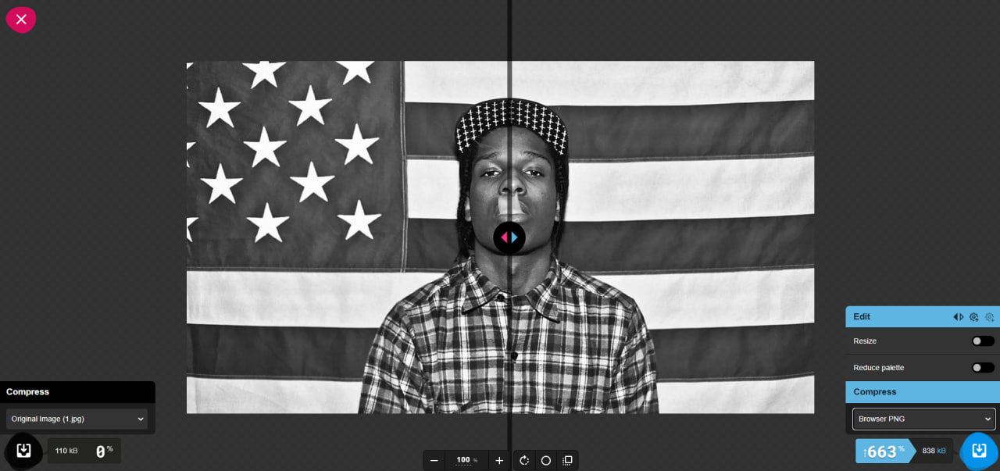
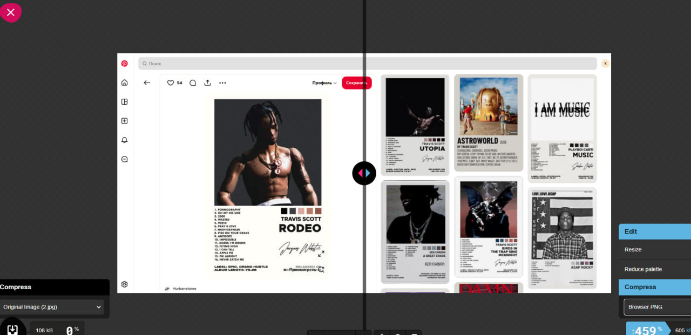
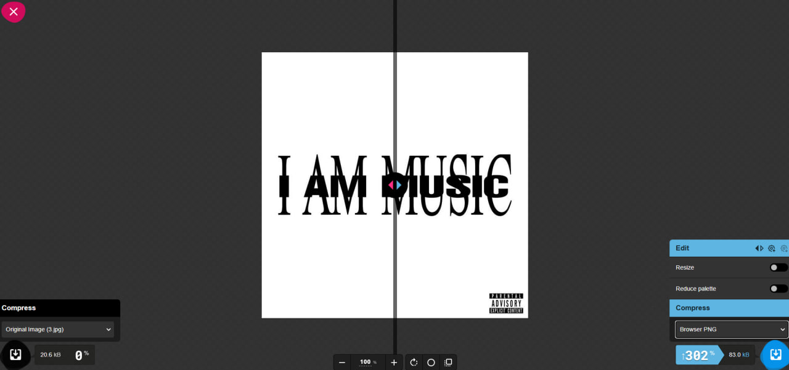

# Оптимізація та стиснення зображень

## Навчальні цілі
1.  **Вивчення методів стиснення:** Ознайомитися з технологіями компресії зображень та зрозуміти, як вони впливають на візуальну якість.
2.  **Пошук балансу:** Навчитися знаходити оптимальне співвідношення між якістю картинки та розміром файлу.
3.  **Типи стиснення:** Розібратися в різниці між форматами зі стисненням без втрат (lossless) та з втратами (lossy).
4.  **Ресайзинг:** Дослідити, як зміна фізичних розмірів (роздільності) впливає на "вагу" файлу.
5.  **Адаптація контенту:** Навчитися готувати зображення для різних сценаріїв:
    * *Web:* Максимальна оптимізація для пришвидшення завантаження сторінок.
    * *Мобільні пристрої:* Ефективне стиснення та зменшення розмірів для економії трафіку.
    * *Retina-дисплеї:* Підготовка версій високої чіткості (2x, 3x).

---

## Теоретичні основи

### 1. Інструментарій: Squoosh
**Squoosh** — це сучасний веб-додаток від Google, призначений для швидкої оптимізації, конвертації та стиснення зображень безпосередньо у браузері.

**Ключові особливості:**
* **Безпека та швидкість:** Завдяки технології WebAssembly усі обчислення відбуваються локально на комп'ютері користувача. Файли не завантажуються на сторонні сервери.
* **Функціонал:** Додаток дозволяє змінювати розмір зображень, налаштовувати рівень якості та конвертувати файли у сучасні формати (WebP, AVIF, MozJPEG, OxiPNG).
* **Наочність:** Інтерфейс має зручний слайдер «до/після», що дозволяє миттєво оцінити візуальні зміни та ефективність стиснення перед збереженням.

### 2. Типи стиснення
Squoosh та сучасні графічні редактори пропонують два основні підходи до зменшення розміру файлів:

* **Стиснення без втрат (Lossless)**
    * *Принцип:* Зображення стискається без видалення графічних даних. Зберігається 100% деталізації та точність кольорів.
    * *Застосування:* Ідеально підходить для логотипів, іконок, креслень, тексту та графіки з чіткими краями.
    * *Формати:* PNG, WebP (у режимі lossless).

* **Стиснення з втратами (Lossy)**
    * *Принцип:* Значне зменшення розміру файлу досягається за рахунок видалення частини інформації, яка є менш помітною для людського ока.
    * *Застосування:* Фотографії, складні градієнти, веб-банери.
    * *Формати:* MozJPEG, WebP (у режимі lossy), AVIF.

### 3. Адаптація під екрани та Retina
Окрім вибору формату, важливим етапом оптимізації є **зміна роздільності (resizing)**. Фізичне зменшення кількості пікселів — найдієвіший спосіб зменшити вагу файлу. Розмір зображення має відповідати контексту використання (наприклад, іконка, прев'ю або повноформатний банер).

**Особливості роботи з екранами високої чіткості:**
* **Retina-дисплеї:** Екрани з високою щільністю пікселів вимагають зображень зі збільшеною роздільністю (версії **2x** або **3x**), щоб графіка виглядала чіткою та деталізованою.
* **Технічна реалізація:** У веб-розробці для цього використовується HTML-атрибут `srcset`. Він дає браузеру набір варіантів зображення, з яких той автоматично обирає найбільш відповідний файл, враховуючи розмір екрана та щільність пікселів конкретного пристрою.

# Практична частина

## Хід роботи
## Аналіз вихідних файлів

* Фотографія

Початковий розмір: 1200 х 675

Формат: JPG

Вага файлу: 107 КБ

* Скріншот

Початковий розмір: 1280 х 623

Формат: JPG

Вага файлу: 105 КБ

* Графічне зображення з текстом
  

Початковий розмір: 640 х 64-

Формат: JPG

Вага файлу: 20 КБ

## 1.Стиснення без втрати якості (lossless)

* PNG (lossless)

* Фотографія
  

Фотографія Після перетворення, вага зображення зросла до 833 КБ.
Якість зображення залишилася незмінною.

* Скріншот

Скріншот Після перетворення, вага зображення зросла до 605 Кб.
Якість зображення залишилася незмінною.

* Графічне зображення з текстом

Графічне зображення з текстом Після перетворення, вага зображення зросла до 83 Кб.
Якість зображення залишилася незмінною.

## 2. WebP (lossless)

Фотографія

Фотографія Після перетворення, вага зображення зменшилася до 1.48 Мб.
Якість зображення залишилася незмінною.

Скріншот

Скріншот Після перетворення, вага зображення зменшилася до 55 Кб.
Якість зображення залишилася незмінною.

Графічне зображення з текстом

Графічне зображення з текстом Після перетворення, вага зображення зменшилася до 177 Кб.
Якість зображення залишилася незмінною.

