# Оптимізація та стиснення зображень

## Навчальні цілі
1.  **Вивчення методів стиснення:** Ознайомитися з технологіями компресії зображень та зрозуміти, як вони впливають на візуальну якість.
2.  **Пошук балансу:** Навчитися знаходити оптимальне співвідношення між якістю картинки та розміром файлу.
3.  **Типи стиснення:** Розібратися в різниці між форматами зі стисненням без втрат (lossless) та з втратами (lossy).
4.  **Ресайзинг:** Дослідити, як зміна фізичних розмірів (роздільності) впливає на "вагу" файлу.
5.  **Адаптація контенту:** Навчитися готувати зображення для різних сценаріїв:
    * *Web:* Максимальна оптимізація для пришвидшення завантаження сторінок.
    * *Мобільні пристрої:* Ефективне стиснення та зменшення розмірів для економії трафіку.
    * *Retina-дисплеї:* Підготовка версій високої чіткості (2x, 3x).

---

## Теоретичні основи

### 1. Інструментарій: Squoosh
**Squoosh** — це сучасний веб-додаток від Google, призначений для швидкої оптимізації, конвертації та стиснення зображень безпосередньо у браузері.

**Ключові особливості:**
* **Безпека та швидкість:** Завдяки технології WebAssembly усі обчислення відбуваються локально на комп'ютері користувача. Файли не завантажуються на сторонні сервери.
* **Функціонал:** Додаток дозволяє змінювати розмір зображень, налаштовувати рівень якості та конвертувати файли у сучасні формати (WebP, AVIF, MozJPEG, OxiPNG).
* **Наочність:** Інтерфейс має зручний слайдер «до/після», що дозволяє миттєво оцінити візуальні зміни та ефективність стиснення перед збереженням.

### 2. Типи стиснення
Squoosh та сучасні графічні редактори пропонують два основні підходи до зменшення розміру файлів:

* **Стиснення без втрат (Lossless)**
    * *Принцип:* Зображення стискається без видалення графічних даних. Зберігається 100% деталізації та точність кольорів.
    * *Застосування:* Ідеально підходить для логотипів, іконок, креслень, тексту та графіки з чіткими краями.
    * *Формати:* PNG, WebP (у режимі lossless).

* **Стиснення з втратами (Lossy)**
    * *Принцип:* Значне зменшення розміру файлу досягається за рахунок видалення частини інформації, яка є менш помітною для людського ока.
    * *Застосування:* Фотографії, складні градієнти, веб-банери.
    * *Формати:* MozJPEG, WebP (у режимі lossy), AVIF.

### 3. Адаптація під екрани та Retina
Окрім вибору формату, важливим етапом оптимізації є **зміна роздільності (resizing)**. Фізичне зменшення кількості пікселів — найдієвіший спосіб зменшити вагу файлу. Розмір зображення має відповідати контексту використання (наприклад, іконка, прев'ю або повноформатний банер).

**Особливості роботи з екранами високої чіткості:**
* **Retina-дисплеї:** Екрани з високою щільністю пікселів вимагають зображень зі збільшеною роздільністю (версії **2x** або **3x**), щоб графіка виглядала чіткою та деталізованою.
* **Технічна реалізація:** У веб-розробці для цього використовується HTML-атрибут `srcset`. Він дає браузеру набір варіантів зображення, з яких той автоматично обирає найбільш відповідний файл, враховуючи розмір екрана та щільність пікселів конкретного пристрою.

# Практична частина

## Хід роботи
## Аналіз вихідних файлів

* Фотографія

Початковий розмір: 1200 х 675

Формат: JPG

Вага файлу: 107 КБ

* Скріншот

Початковий розмір: 1280 х 623

Формат: JPG

Вага файлу: 105 КБ

* Графічне зображення з текстом
  

Початковий розмір: 640 х 64-

Формат: JPG

Вага файлу: 20 КБ

## 1.Стиснення без втрати якості (lossless)

* PNG (lossless)

* Фотографія
  

Фотографія Після перетворення, вага зображення зросла до 833 КБ.

Якість зображення залишилася незмінною.

* Скріншот

Скріншот Після перетворення, вага зображення зросла до 605 Кб.

Якість зображення залишилася незмінною.

* Графічне зображення з текстом

Графічне зображення з текстом Після перетворення, вага зображення зросла до 83 Кб.

Якість зображення залишилася незмінною.

### 2. WebP (lossless)

* Фотографія
  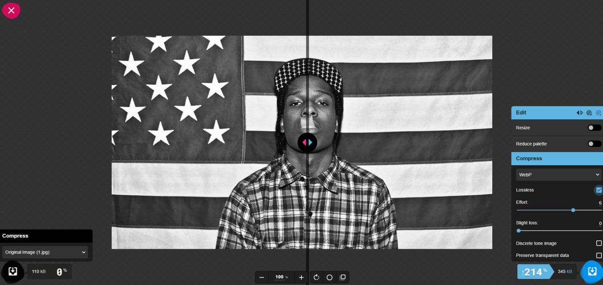

 Після перетворення, вага зображення зросла до 345 КБ.

Якість зображення залишилася незмінною.

* Скріншот

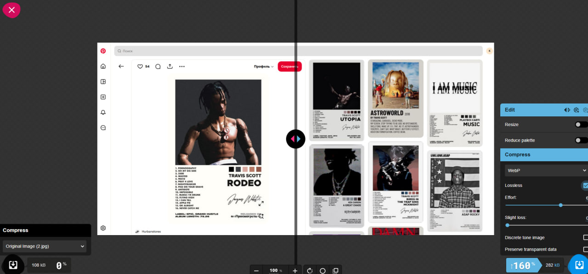

 Після перетворення, вага зображення зросла до 282 КБ.

Якість зображення залишилася незмінною.

* Графічне зображення з текстом
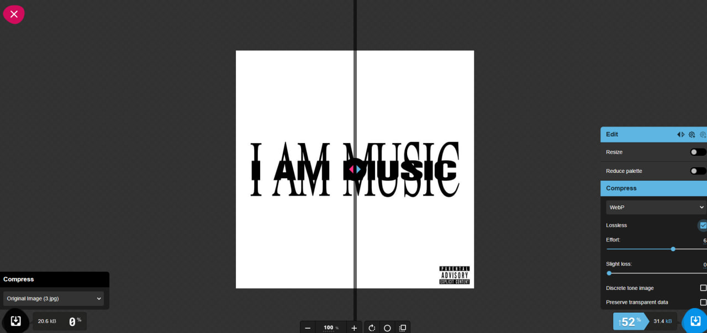

Після перетворення, вага зображення зросла до 31 КБ.

Якість зображення залишилася незмінною.

## Стиснення з втратою якості (lossy)

1. MozJPEG
   * Фотографія
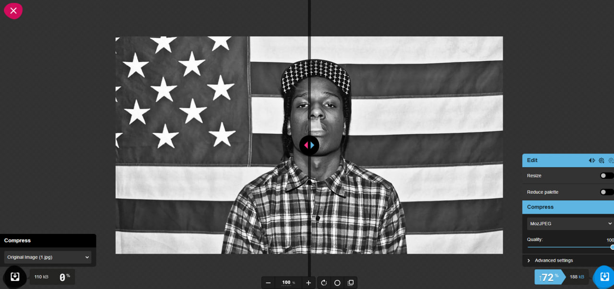
Після стиснення на рівні якості 100%, вага зображення зросла до 188 кб.

Після стиснення на рівні якості 75%, вага зображення зменшалась до 80 кб.

Після стиснення на рівні якості 50%, вага зображення зменшалась до 50 кб.

На мою думку, мінімальний рівень якості, при якому зображення залишається прийнятним - 50%. Оскільки дозволяє досягти максимальної економії обсягу файлу (50 Кб), зберігаючи при цьому достатній рівень візуальної прийнятності та деталізації для перегляду на вебресурсах.
 * Скріншот
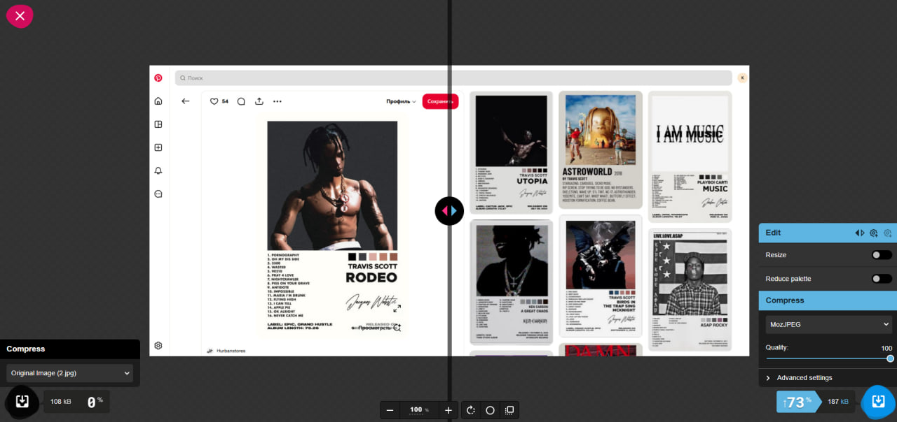
Після стиснення на рівні якості 100%, вага зображення зросла до 187 кб.

Після стиснення на рівні якості 75%, вага зображення зменшалась до 64 кб.
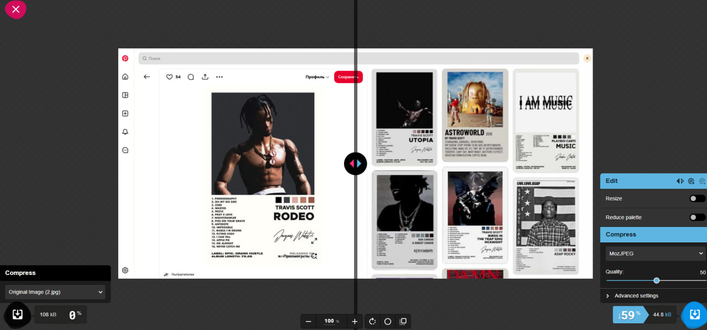
Після стиснення на рівні якості 50%, вага зображення зменшалась до 45 кб.

На мою думку, мінімальний рівень якості, при якому зображення залишається прийнятним - 50%. Оскільки дозволяє досягти максимальної економії обсягу файлу (45 Кб), зберігаючи при цьому достатній рівень візуальної прийнятності та деталізації для перегляду на вебресурсах.

* Графічне зображення з текстом

Після стиснення на рівні якості 100%, вага зображення зросла до 38 кб.

Після стиснення на рівні якості 75%, вага зображення зменшалась до 15 кб.
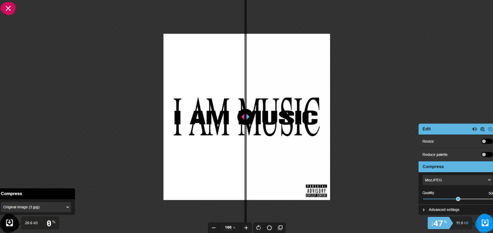
Після стиснення на рівні якості 50%, вага зображення зменшалась до 11 кб.

На мою думку, мінімальний рівень якості, при якому зображення залишається прийнятним - 50%. Оскільки дозволяє досягти максимальної економії обсягу файлу (11 Кб), зберігаючи при цьому достатній рівень візуальної прийнятності та деталізації для перегляду на вебресурсах.

1. WebP
* Фотографія

Після стиснення на рівні якості 100%, вага зображення зросла до 215 кб.

Після стиснення на рівні якості 50%, вага зображення зменшалась до 61 кб.
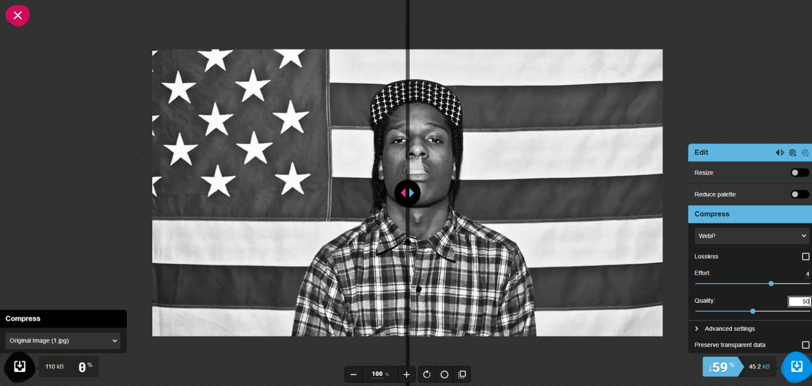
Після стиснення на рівні якості 50%, вага зображення зменшалась до 45 кб.

На мою думку, мінімальний рівень якості, при якому зображення залишається прийнятним - 50%. Оскільки дозволяє досягти максимальної економії обсягу файлу (45 Кб), зберігаючи при цьому достатній рівень візуальної прийнятності та деталізації для перегляду на вебресурсах.

 * Скріншот

Після стиснення на рівні якості 100%, вага зображення зросла до 134 кб.

Після стиснення на рівні якості 75%, вага зображення зменшалась до 44 кб.
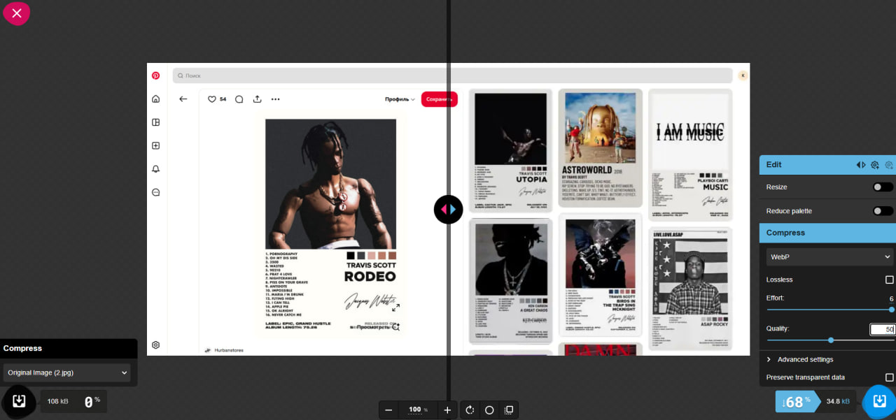
Після стиснення на рівні якості 50%, вага зображення зменшалась до 35 кб.

На мою думку, мінімальний рівень якості, при якому зображення залишається прийнятним - 50%. Оскільки дозволяє досягти максимальної економії обсягу файлу (35 Кб), зберігаючи при цьому достатній рівень візуальної прийнятності та деталізації для перегляду на вебресурсах.

* Графічне зображення з текстом
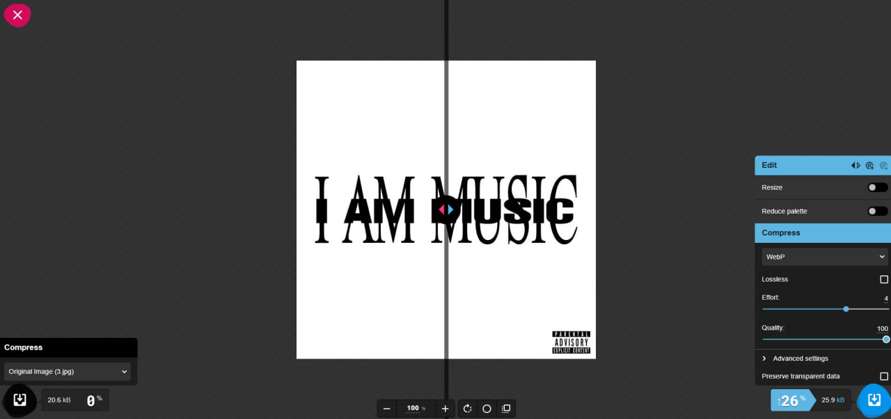
Після стиснення на рівні якості 100%, вага зображення зросла до 26 кб.
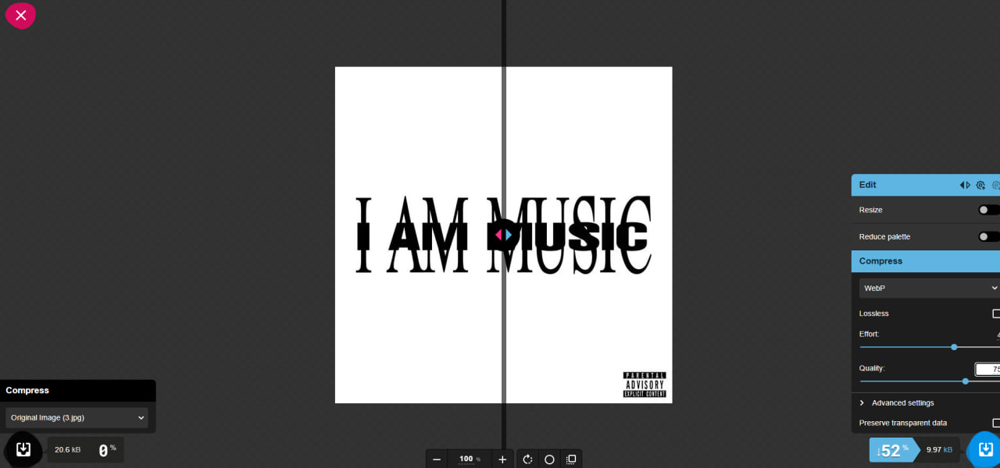
Після стиснення на рівні якості 75%, вага зображення зменшалась до 9.97 кб.
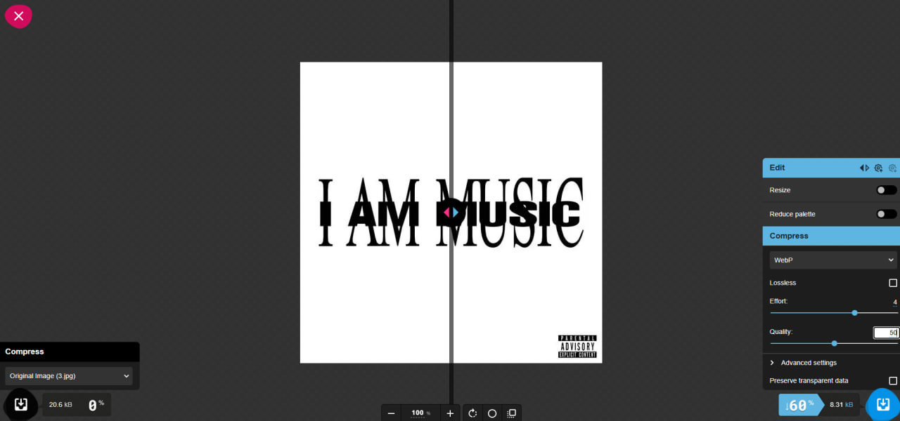
Після стиснення на рівні якості 50%, вага зображення зменшалась до 11 кб.

На мою думку, мінімальний рівень якості, при якому зображення залишається прийнятним - 50%. Оскільки дозволяє досягти максимальної економії обсягу файлу (8.31 Кб), зберігаючи при цьому достатній рівень візуальної прийнятності та деталізації для перегляду на вебресурсах.

3. Avif
   
  * Фотографія
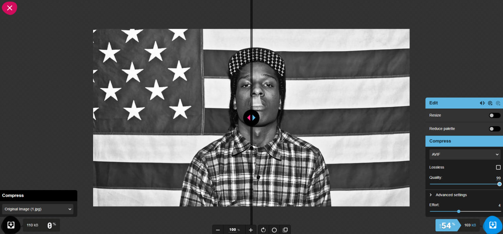
Після стиснення на рівні якості 100%, вага зображення зросла до 169 кб.
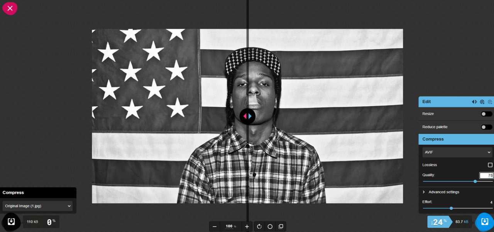
Після стиснення на рівні якості 50%, вага зображення зменшалась до 84 кб.
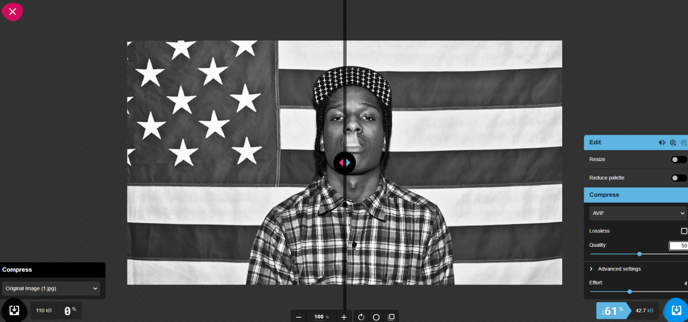
Після стиснення на рівні якості 50%, вага зображення зменшалась до 43 кб.

На мою думку, мінімальний рівень якості, при якому зображення залишається прийнятним - 50%. Оскільки дозволяє досягти максимальної економії обсягу файлу (43 Кб), зберігаючи при цьому достатній рівень візуальної прийнятності та деталізації для перегляду на вебресурсах.

 * Скріншот
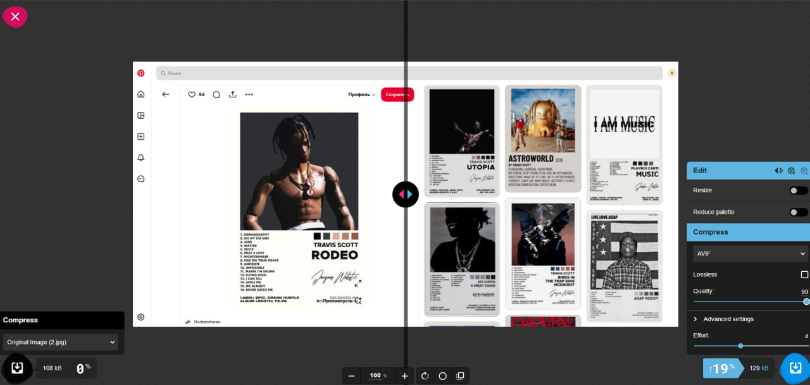
Після стиснення на рівні якості 100%, вага зображення зросла до 129 кб.
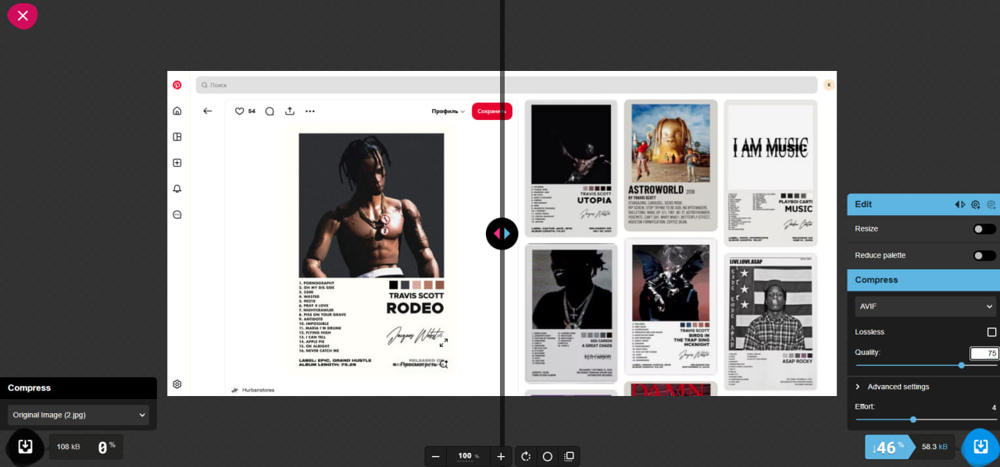
Після стиснення на рівні якості 75%, вага зображення зменшалась до 58 кб.
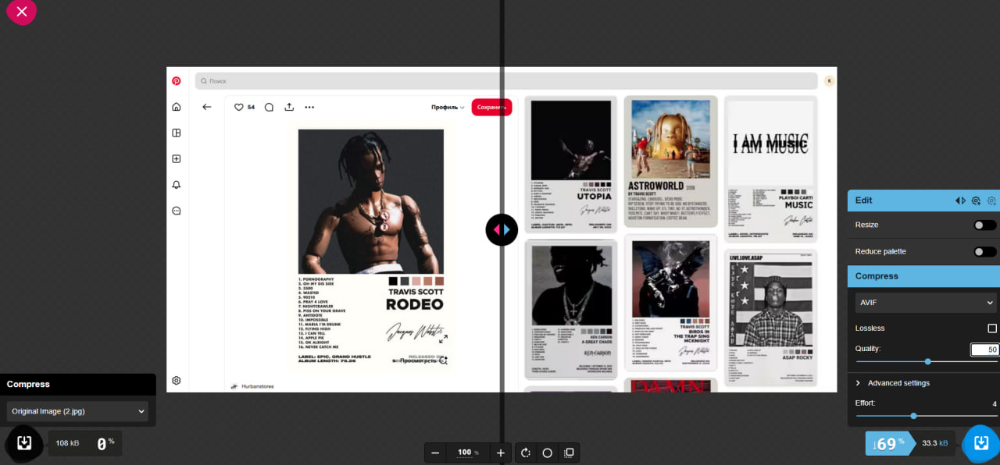
Після стиснення на рівні якості 50%, вага зображення зменшалась до 33 кб.

На мою думку, мінімальний рівень якості, при якому зображення залишається прийнятним - 50%. Оскільки дозволяє досягти максимальної економії обсягу файлу (33 Кб), зберігаючи при цьому достатній рівень візуальної прийнятності та деталізації для перегляду на вебресурсах.

* Графічне зображення з текстом

Після стиснення на рівні якості 100%, вага зображення зросла до 29 кб.
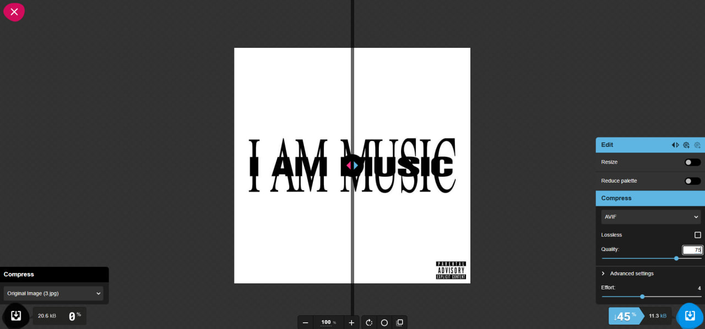
Після стиснення на рівні якості 75%, вага зображення зменшалась до 11 кб.
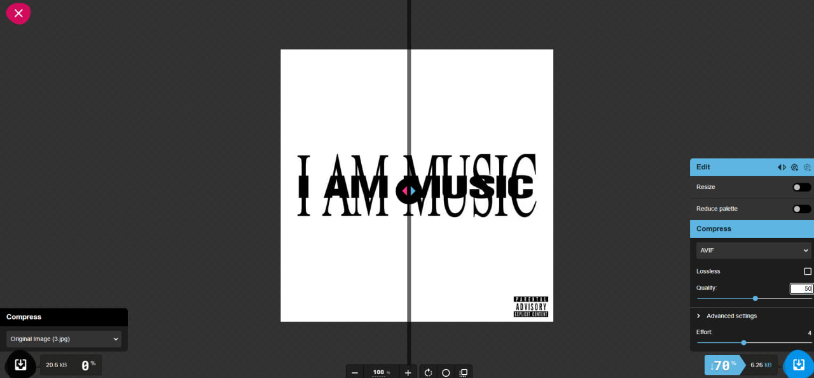
Після стиснення на рівні якості 50%, вага зображення зменшалась до 6 кб.

На мою думку, мінімальний рівень якості, при якому зображення залишається прийнятним - 50%. Оскільки дозволяє досягти максимальної економії обсягу файлу (6 Кб), зберігаючи при цьому достатній рівень візуальної прийнятності та деталізації для перегляду на вебресурсах.

##  Оптимізація розміру відповідно до цільового використання

* Для вебу (максимальна ширина 1200 px)

* Фотографія
  
  Після перетворення, розмір зображення став 1200 х 675, а вага - 257 Кб.
* Скріншот
  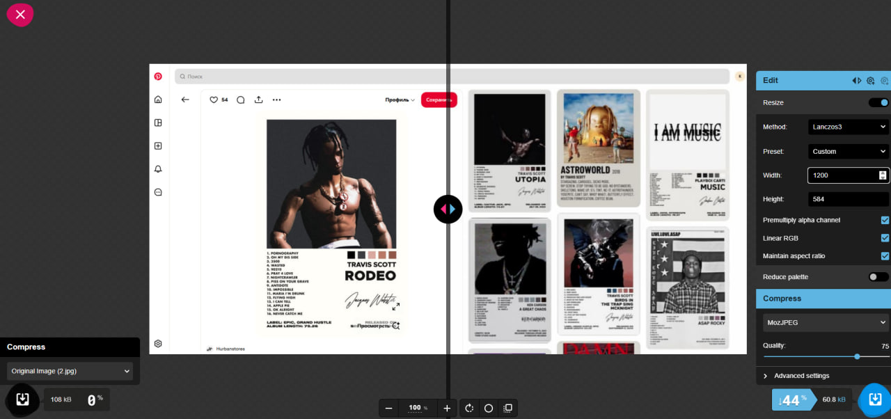
Після перетворення, розмір зображення став 1200 х 584, а вага - 61 Кб.
* Графічне зображення з текстом
   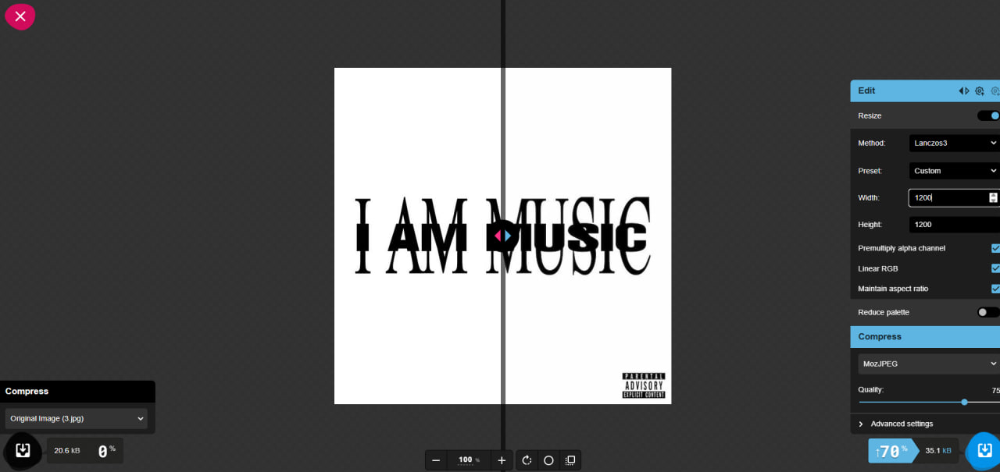
Після перетворення, розмір зображення став 1200 х 1200, а вага - 35 Кб.

* Для мобільних пристроїв: максимальна ширина 600 px.
*  Фотографія
  
  Після перетворення, розмір зображення став 600 х 338, а вага - 28 Кб.
* Скріншот
  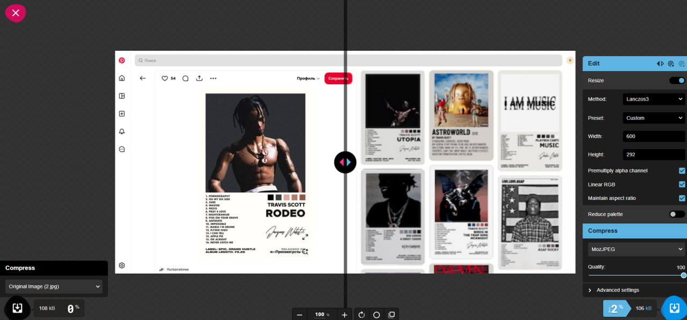
Після перетворення, розмір зображення став 600 х 292, а вага - 106 Кб.
* Графічне зображення з текстом
   
Після перетворення, розмір зображення став 600 х 600, а вага - 50 Кб.

* Для Retina-дисплеїв: створіть 2x  версію зображення.
* Фотографія
  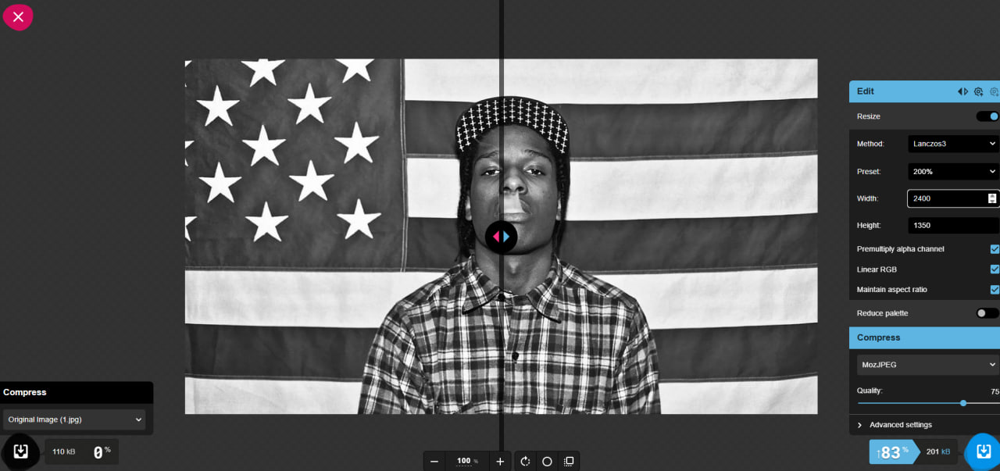
  Після перетворення, розмір зображення став 2400 х 1350, а вага - 201 Кб.
* Скріншот
  
Після перетворення, розмір зображення став 2400 х 1168, а вага - 774 Кб.
* Графічне зображення з текстом
   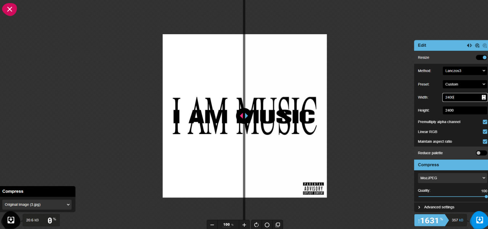
Після перетворення, розмір зображення став 2400 х 2400, а вага - 357 Кб.

* Для Retina-дисплеїв: створіть  3x версію зображення.
* Фотографія
  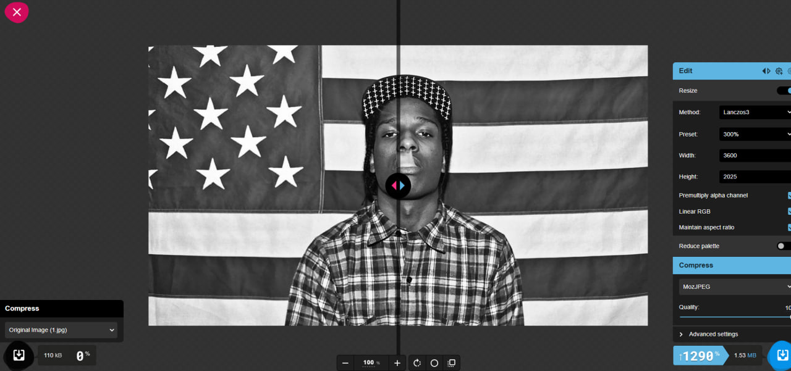
  Після перетворення, розмір зображення став 3600 х 2025, а вага - 1.53 Mb.
* Скріншот
  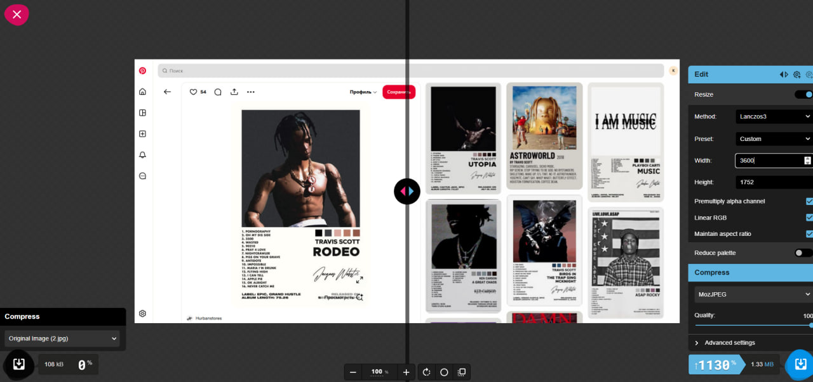
Після перетворення, розмір зображення став 3600 х 1752, а вага - 1.33 Mb.
* Графічне зображення з текстом
   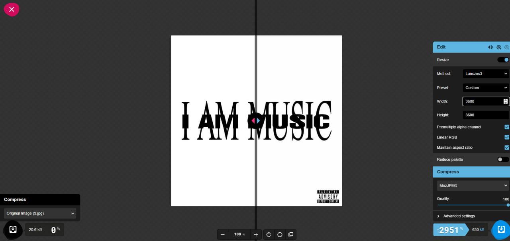
Після перетворення, розмір зображення став 3600 х 3600, а вага - 630 Кб.

# Висновки
Робота з трьома різними типами зображень підтвердила, що ефективність стиснення залежить не лише від обраного інструменту, але й від правильного підбору формату та параметрів якості відповідно до контенту зображення.

Для фотографій зі складною колірною палітрою найбільш ефективним є формат AVIF (lossy), оскільки він забезпечує найвищий коефіцієнт стиснення (до 99%) порівняно з PNG та WebP, зберігаючи при цьому необхідну візуальну прийнятність. Натомість, для скріншотів, де важлива чіткість тексту та мінімізація артефактів на однотонних областях, оптимальним вибором є WebP (lossless), який дозволяє зменшити розмір файлу на 72% без втрати якості. А для графічних зображень з векторними елементами, AVIF (lossy), навіть при якості 30%, також виявився найкращим, показавши виняткову ефективність, дозволивши зменшити вагу файлу на 97% (до 6.36 Кб).

Також важливим етапом оптимізації є зміна розміру зображення відповідно до цільового використання. Аналіз підтвердив, що зменшення розміру від вихідного до цільового призводить до найбільш значного скорочення ваги файлу. Цей крок є фундаментальним, оскільки він усуває надлишкове навантаження на мережу та потужності браузера, необхідні для масштабування.

Для забезпечення високої якості зображень на екранах із підвищеною щільністю пікселів (Retina) потрібна правильна адаптація. Це досягається подачею версій зображень із більшою роздільною здатністю, що неминуче збільшує вагу файлу. Тому впровадження має відбуватися за допомогою адаптивних методів, таких як атрибут srcset. Цей інструмент дозволяє браузеру самостійно вибрати найбільш відповідний розмір зображення, подаючи версію з високою роздільною здатністю лише користувачам із відповідними пристроями, що забезпечує як якість, так і швидкість завантаження для всіх користувачів.

Результати роботи вказують на перевагу сучасних форматів AVIF та WebP над традиційними JPEG та PNG. Для досягнення максимальної швидкості завантаження та високої візуальної якості важливо поєднувати три основні стратегії: вибір оптимального формату, контрольоване стиснення з втратами та адаптацію фізичного розміру відповідно до цільового пристрою.
