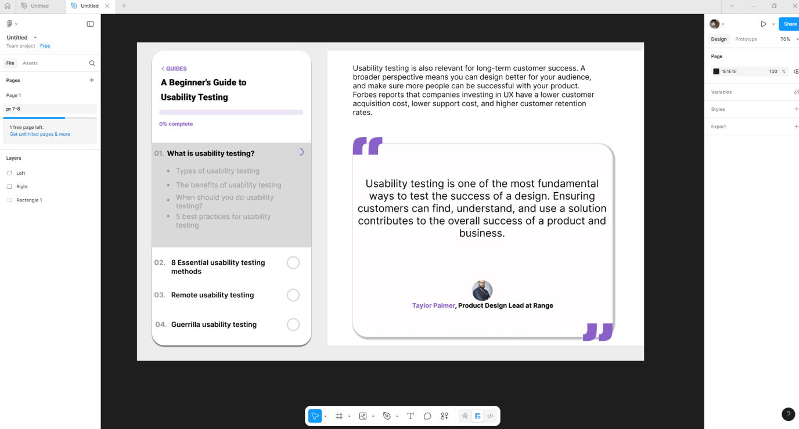

# Практична робота 7-8
## Тема:Типографіка в дизайні інтерфейсів

# Хід роботи:
1. Опрацьовано теоретичний матеріал із Google-документу
2. Вивчити основні принципи типографіки у UI/UX-дизайні
3. Виконати завдання
1. Фінальний результат

# Посилання
[Figma page 2](https://www.figma.com/design/84NxmwaFSGGRW46gijMhOR/Untitled?node-id=19-2&t=pbj0diwrnMMiOP2g-1)
# Висновок 
Отже на цих практичних завданнях я ознайомився з теоретичними відомостями про типографіку в дизайні та відтворив свої теоретичні навички на практиці створивши частинку вебсторінки.
